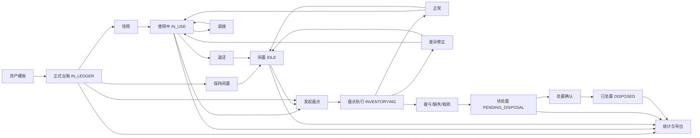
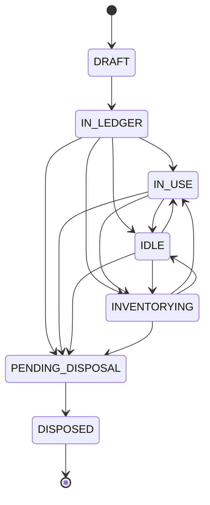
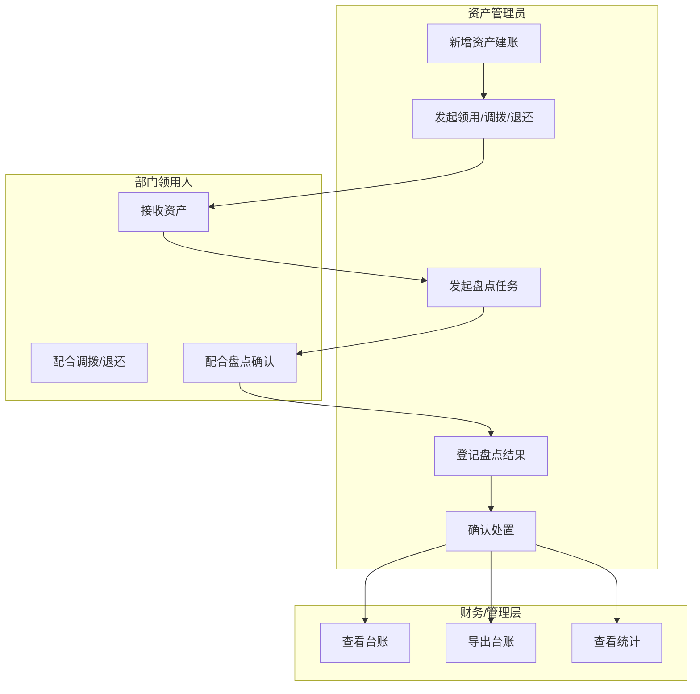
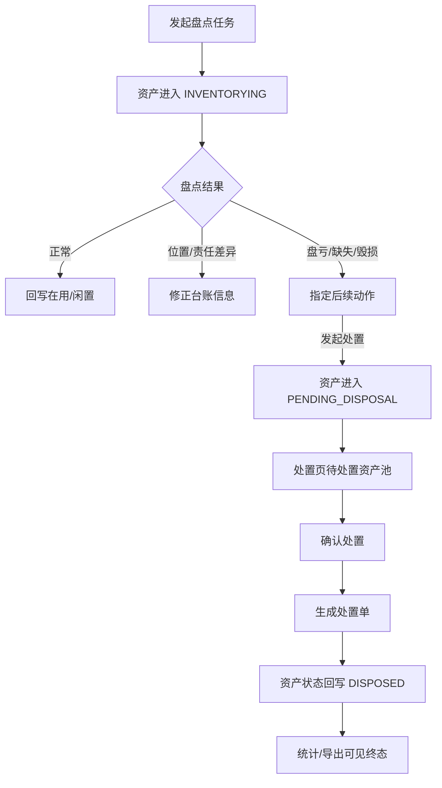
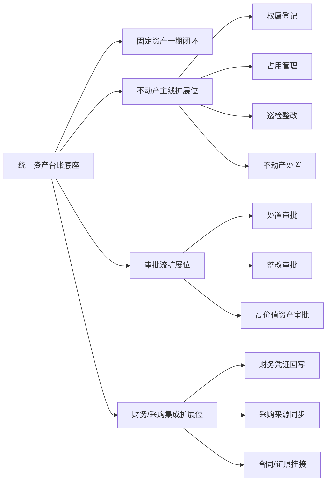

# 2026-03-20 资产一期收口整改与二期扩展位设计

## 1. 背景与目标

本设计面向当前仓库中已经完成“固定资产第一期最小闭环”的资产模块实现，目标不是重新定义一期范围，而是在以下前提下完成收口：

- 先按第一期执行计划和 UAT 清单确认固定资产最小闭环的完成度
- 再按系统总设计识别统一资产管理系统的后续缺口
- 直接落地一批最高优先级整改
- 同时补齐不动产、审批、集成所需的最小扩展位，但不在本批次上线不动产流程

本次设计的核心结论为：

> 当前资产模块已经达到“固定资产一期最小闭环可试运行”的状态，但仍缺一份统一收口文档、一套生命周期聚合视图，以及面向二期的不动产/审批/集成扩展位口径。

---

## 2. 双基线评审框架

### 2.1 第一层：一期交付完成度评审

评审基线：

- `docs/plans/2026-03-18-asset-management-system-phase1-execution-plan.md`
- `docs/plans/2026-03-18-asset-management-system-phase1-uat-checklist.md`

这一层只回答一个问题：

> 固定资产第一期最小闭环是否已经达到可试运行、可收口、可验收的程度？

判定维度固定为 5 类：

1. 业务链路是否走通
2. 状态回写是否正确
3. 单据留痕是否完整
4. 前端操作体验是否支持资产管理员高效作业
5. 测试、点测、UAT 证据是否充分

### 2.2 第二层：系统总设计缺口评审

评审基线：

- `docs/plans/2026-03-18-asset-management-system-design.md`

这一层只回答另一个问题：

> 当前一期实现距离统一资产管理系统总蓝图，还缺哪些能力、哪些模型扩展位、哪些流程边界？

该层不把“不动产未上线”“审批流未上线”误判为一期失败，而是明确归类为二期能力缺口。

---

## 3. 差距分层方法

### 3.1 P0 一期阻塞整改

定义：直接影响固定资产闭环试运行和验收的问题。

典型问题：

- 状态回写错误
- 盘点/处置链路断裂
- 单据留痕缺失
- 路由/权限异常
- 详情页无法支撑资产生命周期核查

### 3.2 P1 一期收口增强

定义：不阻塞闭环，但影响资产管理员效率、财务口径一致性和 UAT 体验的问题。

典型问题：

- 列表页、任务页、表单页、详情页骨架不统一
- 统计与导出字段表达不充分
- 详情页缺少过程聚合与轨迹可视化

### 3.3 P2 二期扩展位补强

定义：本批次不直接上线业务流程，但必须预留的模型和接口扩展位。

典型问题：

- 不动产字段承载方式
- 审批挂接位
- 财务/采购集成标识
- 差异化详情视图与差异化流程入口

---

## 4. 一期固定资产闭环设计

### 4.1 闭环原则

固定资产一期闭环统一遵循以下原则：

- 台账主档只承载资产当前态
- 交接、盘点、处置全部通过业务单据留痕
- 关键状态变化必须由业务动作驱动
- 统计与导出消费的是已回写的业务结果

可收口的判定标准不是“页面多不多”，而是以下 4 条是否同时满足：

1. 任何关键状态变化都能追溯到一笔业务动作
2. 任何业务动作都能回写台账当前态
3. 资产管理员首屏先看到可操作对象，而不是说明堆叠
4. 同类页面共用同一骨架，不再一页一个样子

### 4.2 一期固定资产最小闭环总流程

### 4.3 状态流转图

### 4.4 资产管理员视角泳道图

### 4.5 盘点异常转处置闭环图

---

## 5. 现状评审结果草案

### 5.1 按一期执行计划看

当前固定资产一期最小闭环已经基本成立，主要证据如下：

- 台账主档已支持建账、查询、详情、编辑、导出
- 交接主单/明细已承载领用、调拨、退还
- 盘点任务、盘点结果、异常后续动作已形成完整业务链
- 处置确认已能把待处置资产回写为 `DISPOSED`
- 已有后端单测、前端 Vitest、资产管理员点测与 UAT 清单

因此，一期不应被认定为“未完成”，准确口径应为：

> 固定资产一期最小闭环已完成并进入试运行/问题收口阶段。

### 5.2 按系统总设计看

当前实现仍明显停留在“固定资产一期闭环”，与统一资产系统总设计之间至少存在以下缺口：

- 不动产主线尚未进入业务流程，仅在 `asset_type` 等字段层预留扩展位
- 审批流、合同证照、财务/采购深度集成尚未落地
- 详情聚合、轨迹可视化和跨页面一致体验仍需增强

因此，准确表述应为：

> 当前已完成“固定资产一期最小闭环设计落地”，但尚未完成“统一资产管理系统总蓝图”的全部范围。

---

## 6. 第一批整改项

### 6.1 P0 一期阻塞整改

1. 新增统一收口设计文档  
   统一承接双基线评审、差距清单、整改优先级、流程图与扩展位设计。

2. 补资产生命周期聚合详情  
   当前详情页仍偏主档展示，未真正聚合交接、盘点、处置、变更轨迹，无法支撑资产管理员核查一项资产的全生命周期。

3. 统一资产详情页口径  
   详情页应从“字段展示页”升级为“当前态 + 生命周期 + 最近业务动作”的聚合页，为后续不动产详情页形成模板。

### 6.2 P1 一期收口增强

1. 固化列表页/任务页/表单页/详情页四类页面模板
2. 评审导出字段与财务查看口径
3. 增强统计总览中的关键提示字段

### 6.3 P2 二期扩展位补强

1. 详情页和接口响应预留资产类型差异化展示能力
2. 业务单据与变更日志预留审批挂接位和集成来源标识
3. 明确不动产权属/占用/巡检整改主线如何挂接到统一台账

---

## 7. 第一批直接落地范围

本轮直接落地范围收敛为：

1. 新增统一收口设计文档
2. 新增资产生命周期聚合详情接口
3. 改造资产详情页，展示：
   - 当前状态摘要
   - 生命周期轨迹时间线
   - 最近交接记录
   - 最近盘点记录
   - 最近处置记录
4. 补 API 测试、服务测试和详情页前端点测

本轮明确不做：

- 不动产主线业务上线
- 审批流上线
- 外部系统集成上线

---

## 8. 二期扩展位边界图

---

## 9. 结论

当前最合理的推进方式不是把不动产流程立即塞进一期，而是：

- 用统一收口设计把一期固定资产闭环口径说清
- 用生命周期聚合详情补齐资产管理员最关键的核查视图
- 用扩展位设计为不动产、审批、集成的二期实现降低返工

这既保证一期继续收口，也保证后续演进不会推翻当前架构。
