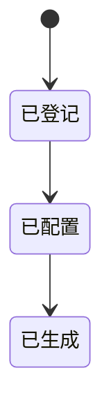

# 开发支撑域

## 业务定位
开发支撑域负责数据模型驱动的代码生产能力。  
该域支持导入数据表、维护字段元信息、预览代码、下载代码、同步数据库模型。  
该域的核心价值是缩短交付周期并统一实现风格。

## 关联域

**组织与权限域 ↔ 本模块**：
- 本模块视角：需要权限域提供开发功能访问控制。
- 组织与权限域视角：需要本模块提供生成发布动作的审计线索。

## 业务场景清单

| 序号 | 场景名称 | 业务目标 |
|------|---------|---------|
| 1 | 数据表导入生成代码 | 从业务数据模型快速生成标准代码 |
| 2 | 在线建表与模板生成 | 从在线建表语句生成完整骨架代码 |

## 核心实体生命周期

### 生成任务 状态流转

| 状态 | 如何进入 | 可流转到 | 触发场景 | 是否终态 |
|------|---------|---------|---------|---------|
| 已登记 | 导入数据表或创建数据表 | 已配置、已生成 | 数据表导入生成代码；在线建表与模板生成 | 否 |
| 已配置 | 完成字段与模板配置 | 已生成 | 数据表导入生成代码；在线建表与模板生成 | 否 |
| 已生成 | 执行生成、下载或发布 | 无 | 数据表导入生成代码；在线建表与模板生成 | 是 |

### 状态流转图

