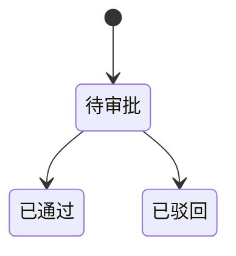

# 流程审批域

## 业务定位
流程审批域为业务单据提供统一审批能力。  
该域负责审批模板治理、待办分发、审批动作执行、审批轨迹沉淀、审批结果回写触发。  
该域只负责审批语义，不直接维护业务主档事实。

## 关联域

**资产域 ↔ 本模块**：
- 本模块视角：需要资产域提供业务单据标识与业务类型。
- 资产域视角：需要本模块回传通过或驳回结果并触发回写。

**组织与权限域 ↔ 本模块**：
- 本模块视角：需要组织与权限域提供审批人身份与待办访问权限。
- 组织与权限域视角：需要本模块提供审批动作权限点。

## 业务场景清单

| 序号 | 场景名称 | 业务目标 |
|------|---------|---------|
| 1 | 审批模板配置 | 保障每类业务有可用审批模板与审批人 |
| 2 | 审批待办处理 | 保障待办处理过程可控且不可重复 |
| 3 | 审批结果回写业务 | 把审批语义转化为业务状态变化 |

## 核心实体生命周期

### 审批实例 状态流转

| 状态 | 如何进入 | 可流转到 | 触发场景 | 是否终态 |
|------|---------|---------|---------|---------|
| 待审批 | 业务单据发起审批 | 已通过、已驳回 | 审批待办处理 | 否 |
| 已通过 | 审批人执行通过 | 无 | 审批待办处理 | 是 |
| 已驳回 | 审批人执行驳回 | 无 | 审批待办处理 | 是 |

### 状态流转图

