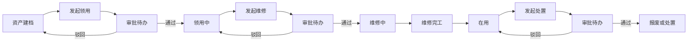
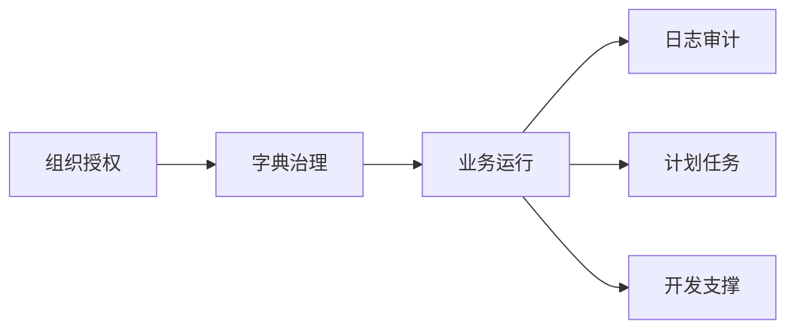

# 业务主线

## 主线一：固定资产领用-维修-处置闭环

**概述**：围绕固定资产的日常使用与退出，形成可审批、可回退、可审计的全生命周期闭环。

**流经域与关键场景**：

| 步骤 | 所属域 | 触发场景 | 产出 |
|------|--------|---------|------|
| 1 | 资产域 | 资产台账建档与维护 | 可用资产主档 |
| 2 | 资产域 | 固定资产领用与归还 | 领用动作单据、资产进入领用中 |
| 3 | 流程审批域 | 审批待办处理 | 领用通过或驳回结果 |
| 4 | 资产域 | 固定资产维修闭环 | 维修动作单据、资产进入维修中或回归在用 |
| 5 | 流程审批域 | 审批待办处理 | 维修通过或驳回结果 |
| 6 | 资产域 | 固定资产处置闭环 | 处置动作单据、资产进入报废或处置终态 |

### 主线流程图

## 主线二：不动产权属与用途治理主线

**概述**：围绕不动产登记事实、权属归属、用途变化、状态变化、注销处置形成治理链路。

**流经域与关键场景**：

| 步骤 | 所属域 | 触发场景 | 产出 |
|------|--------|---------|------|
| 1 | 资产域 | 资产台账建档与维护 | 不动产主档与登记事实 |
| 2 | 资产域 | 不动产权属变更 | 权属变更动作单据 |
| 3 | 流程审批域 | 审批待办处理 | 权属通过或驳回结果 |
| 4 | 资产域 | 不动产用途变更 | 用途快照与主档即时更新 |
| 5 | 资产域 | 不动产状态变更 | 状态快照与主档即时更新 |
| 6 | 资产域 | 不动产注销处置 | 注销处置动作单据及终态更新 |

### 主线流程图

## 主线三：平台治理与持续运营主线

**概述**：保障业务持续运行，覆盖组织授权、审计追踪、任务调度、开发提效。

**流经域与关键场景**：

| 步骤 | 所属域 | 触发场景 | 产出 |
|------|--------|---------|------|
| 1 | 组织与权限域 | 用户与组织管理 | 账号、组织、角色基线 |
| 2 | 组织与权限域 | 菜单权限与字典治理 | 权限矩阵、状态字典 |
| 3 | 运维与计划任务域 | 在线用户与日志审计 | 操作留痕与安全追踪 |
| 4 | 运维与计划任务域 | 计划任务编排与执行日志 | 自动化任务与执行证据 |
| 5 | 开发支撑域 | 数据表导入生成代码 | 标准化代码产物 |

### 主线流程图

