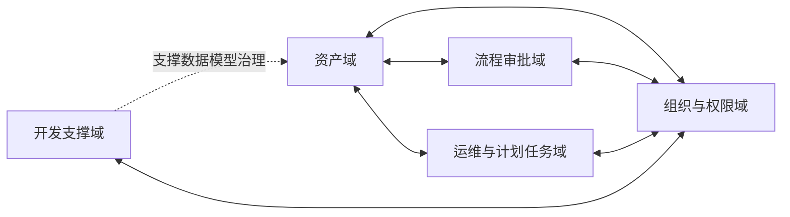

# 业务域全景

## 业务域清单

| 序号 | 域名称 | 职责概述 | 业务链位置 |
|------|--------|---------|-----------|
| 1 | 资产域 | 管理资产主档、分类、扩展属性、财务口径、生命周期动作单据、统计预警 | 起点与中游 |
| 2 | 流程审批域 | 受理待办、执行审批动作、回写业务结果 | 中游 |
| 3 | 组织与权限域 | 管理用户、角色、菜单、字典、参数与登录安全规则 | 支撑 |
| 4 | 运维与计划任务域 | 管理在线会话、审计日志、缓存监控、服务器监控、计划任务执行 | 支撑 |
| 5 | 开发支撑域 | 维护数据模型元信息并生成标准化业务代码 | 支撑 |

## 域间关系矩阵

| 域对 | 协作说明 |
|------|---------|
| 资产域 ↔ 流程审批域 | 资产域发起审批申请，流程审批域回传通过或驳回结果，资产域据此更新资产状态与动作单据状态 |
| 资产域 ↔ 组织与权限域 | 资产域使用组织人员、部门、菜单权限、状态字典作为治理基线；组织与权限域消费资产域新增菜单与权限标识 |
| 资产域 ↔ 运维与计划任务域 | 资产域产生日志与运行指标；运维域提供日志审计与计划任务调度能力 |
| 流程审批域 ↔ 组织与权限域 | 流程审批域依赖人员身份与菜单权限控制审批动作 |
| 运维与计划任务域 ↔ 组织与权限域 | 运维域依赖角色与菜单授权控制查看、清理、执行动作 |
| 开发支撑域 ↔ 组织与权限域 | 开发支撑域依赖权限进行元数据维护与代码生成发布 |

## 全局业务域关系图

