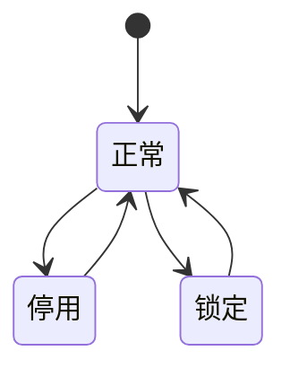

# 组织与权限域

## 业务定位
组织与权限域负责平台身份体系与访问控制体系。  
该域覆盖用户、部门、岗位、角色、菜单、字典、参数、公告、登录安全与个人中心。  
该域对外提供“谁能看、谁能做、看哪些数据、按什么口径做”的治理能力。

## 关联域

**资产域 ↔ 本模块**：
- 本模块视角：需要资产域提供新增功能权限点需求。
- 资产域视角：需要本模块提供用户身份、部门关系、字典口径、菜单权限。

**流程审批域 ↔ 本模块**：
- 本模块视角：需要审批域提供动作权限定义。
- 流程审批域视角：需要本模块提供审批人身份与访问授权。

**运维与计划任务域 ↔ 本模块**：
- 本模块视角：需要运维域提供敏感动作清单用于授权。
- 运维与计划任务域视角：需要本模块提供角色授权与数据范围控制。

## 业务场景清单

| 序号 | 场景名称 | 业务目标 |
|------|---------|---------|
| 1 | 用户与组织管理 | 管理账号、部门、岗位、角色关系 |
| 2 | 角色授权与数据范围 | 管理菜单权限与数据范围权限 |
| 3 | 菜单权限与字典治理 | 维护系统功能入口与业务口径 |
| 4 | 账号安全与个人中心 | 管理登录、注册、密码、头像、会话安全 |

## 核心实体生命周期

### 用户账号 状态流转

| 状态 | 如何进入 | 可流转到 | 触发场景 | 是否终态 |
|------|---------|---------|---------|---------|
| 正常 | 新建账号；启用账号 | 停用 | 用户与组织管理；账号安全与个人中心 | 否 |
| 停用 | 管理员停用 | 正常 | 用户与组织管理 | 否 |
| 锁定 | 连续认证失败触发 | 正常 | 账号安全与个人中心 | 否 |

### 状态流转图

