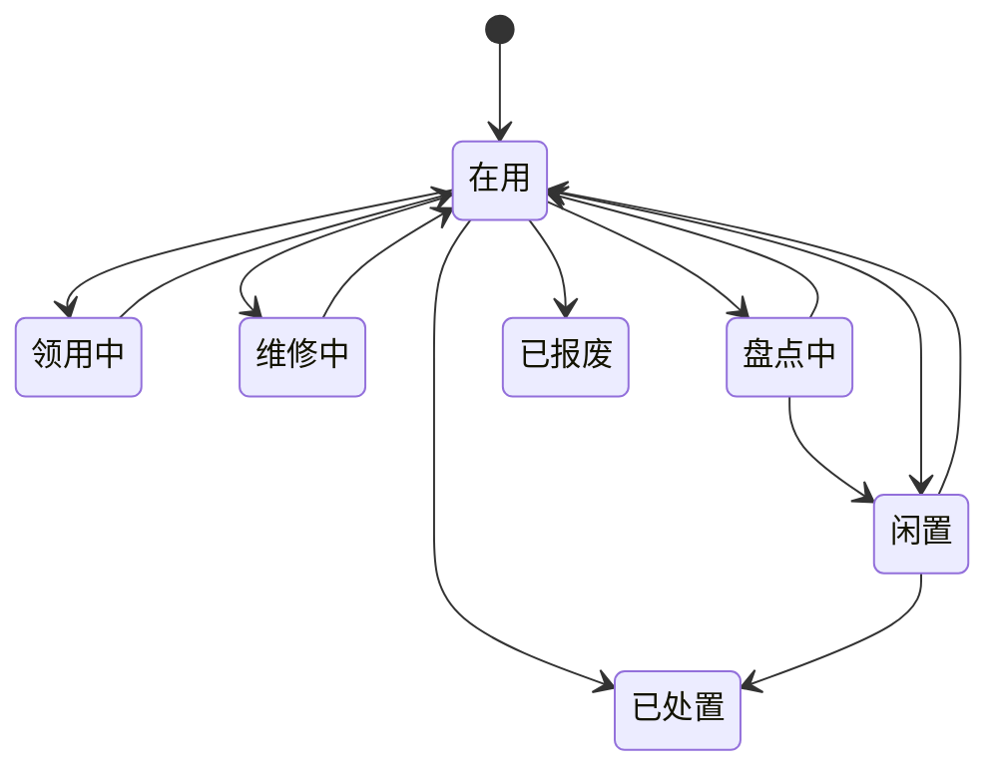

# 资产域

## 业务定位
资产域负责全量资产台账治理，覆盖固定资产与不动产。  
该域统一管理资产主档、扩展属性、附件、财务折旧、动作单据、统计预警，并通过审批结果驱动状态流转。  
该域对外输出资产事实与生命周期结果，对内保证“状态可追踪、动作可回放、归档可审计”。

## 关联域

**流程审批域 ↔ 本模块**：
- 本模块视角：领用、维修、处置、权属变更、注销处置需要审批引擎给出通过或驳回结果。
- 流程审批域视角：审批域需要资产域提供单据标识、业务类型、回调处理能力。

**组织与权限域 ↔ 本模块**：
- 本模块视角：需要组织人员、部门、角色、字典口径、菜单权限。
- 组织与权限域视角：需要资产域提供新增功能的权限点与菜单路径。

**运维与计划任务域 ↔ 本模块**：
- 本模块视角：需要计划任务调度与运行监控，保障批量折旧与治理任务。
- 运维与计划任务域视角：需要资产域提供任务目标、失败补偿策略、核对标准。

## 业务场景清单

| 序号 | 场景名称 | 业务目标 |
|------|---------|---------|
| 1 | 资产台账建档与维护 | 建立资产主档并持续维护主数据 |
| 2 | 固定资产领用与归还 | 管理固定资产领用闭环与归还闭环 |
| 3 | 固定资产维修闭环 | 管理维修申请、审批、完工闭环 |
| 4 | 固定资产处置闭环 | 管理报废、出售、划转、捐赠闭环 |
| 5 | 不动产权属变更 | 管理权属事实审批与回写 |
| 6 | 不动产用途变更 | 管理用途事实变更与留痕 |
| 7 | 不动产状态变更 | 管理状态事实变更与留痕 |
| 8 | 不动产注销处置 | 管理不动产注销处置审批闭环 |
| 9 | 资产财务折旧与重算 | 统一折旧口径并支持重算 |
| 10 | 资产归档控制 | 在合规前提下关闭台账生命周期 |
| 11 | 资产统计与预警 | 输出统计总览与风险预警 |

## 核心实体生命周期

### 资产主档 状态流转

| 状态 | 如何进入 | 可流转到 | 触发场景 | 是否终态 |
|------|---------|---------|---------|---------|
| 在用 | 建档完成；领用归还完成；维修完工完成；审批驳回回滚 | 领用中、维修中、盘点中、已报废、已处置、闲置 | 资产台账建档与维护；固定资产领用与归还；固定资产维修闭环；固定资产处置闭环 | 否 |
| 领用中 | 发起领用并提交审批后 | 在用 | 固定资产领用与归还 | 否 |
| 维修中 | 发起维修并提交审批后 | 在用 | 固定资产维修闭环 | 否 |
| 盘点中 | 发起盘点业务后 | 在用、闲置 | [待确认]盘点流程细则 | 否 |
| 闲置 | 人工调整或盘点确认后 | 在用、已处置 | 资产台账建档与维护；固定资产处置闭环 | 否 |
| 已报废 | 处置审批通过且处置类型为报废 | 无 | 固定资产处置闭环 | 是 |
| 已处置 | 处置审批通过且处置类型为出售、划转、捐赠；不动产注销处置通过 | 无 | 固定资产处置闭环；不动产注销处置 | 是 |

### 固定资产动作单据 状态流转

| 状态 | 如何进入 | 可流转到 | 触发场景 | 是否终态 |
|------|---------|---------|---------|---------|
| 审批中 | 新建领用单；新建维修单；新建处置单 | 已通过、已驳回 | 固定资产领用与归还；固定资产维修闭环；固定资产处置闭环 | 否 |
| 已通过 | 审批通过 | 已归还、维修完成、已完成 | 固定资产领用与归还；固定资产维修闭环；固定资产处置闭环 | 否 |
| 已驳回 | 审批驳回 | 无 | 固定资产领用与归还；固定资产维修闭环；固定资产处置闭环 | 是 |
| 已归还 | 领用归还完成 | 无 | 固定资产领用与归还 | 是 |
| 维修完成 | 维修完工完成 | 无 | 固定资产维修闭环 | 是 |
| 已完成 | 处置完成收口 | 无 | 固定资产处置闭环 | 是 |

### 不动产动作单据 状态流转

| 状态 | 如何进入 | 可流转到 | 触发场景 | 是否终态 |
|------|---------|---------|---------|---------|
| 审批中 | 新建权属变更单；新建注销处置单 | 已通过、已驳回 | 不动产权属变更；不动产注销处置 | 否 |
| 已通过 | 审批通过 | 无 | 不动产权属变更；不动产注销处置 | 是 |
| 已驳回 | 审批驳回 | 无 | 不动产权属变更；不动产注销处置 | 是 |
| 已完成 | 新建用途变更单或状态变更单即完成 | 无 | 不动产用途变更；不动产状态变更 | 是 |

### 状态流转图

