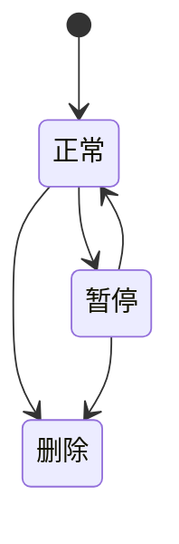

# 运维与计划任务域

## 业务定位
运维与计划任务域提供平台运行可观测能力与自动化执行能力。  
该域覆盖在线用户监控、操作日志、登录日志、缓存监控、服务器监控、任务编排与执行日志。  
该域确保“问题可发现、执行可追溯、故障可回放”。

## 关联域

**组织与权限域 ↔ 本模块**：
- 本模块视角：需要角色与权限控制敏感运维动作。
- 组织与权限域视角：需要本模块提供运维动作清单以便授权。

**资产域 ↔ 本模块**：
- 本模块视角：需要资产域提供批量任务参数与核对规则。
- 资产域视角：需要本模块提供计划任务执行与监控能力。

## 业务场景清单

| 序号 | 场景名称 | 业务目标 |
|------|---------|---------|
| 1 | 在线用户与日志审计 | 提供在线会话治理与审计能力 |
| 2 | 缓存与服务器监控 | 提供性能可视与缓存治理能力 |
| 3 | 计划任务编排与执行日志 | 提供任务全生命周期治理能力 |

## 核心实体生命周期

### 计划任务 状态流转

| 状态 | 如何进入 | 可流转到 | 触发场景 | 是否终态 |
|------|---------|---------|---------|---------|
| 正常 | 新建任务启用 | 暂停 | 计划任务编排与执行日志 | 否 |
| 暂停 | 管理员停用任务 | 正常 | 计划任务编排与执行日志 | 否 |
| 删除 | 管理员删除任务 | 无 | 计划任务编排与执行日志 | 是 |

### 状态流转图

